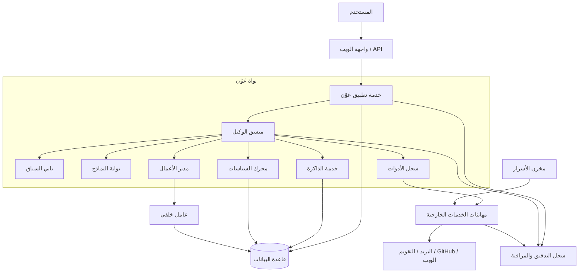
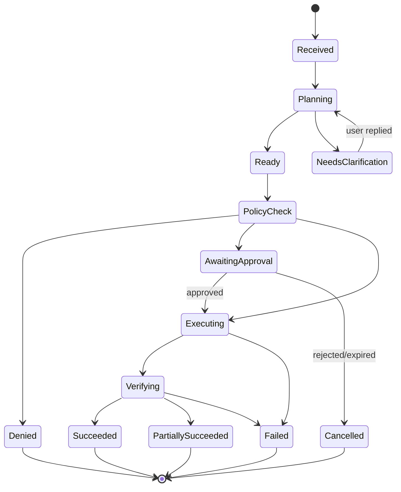

# البنية التقنية لعَوْن

**الحالة:** تصميم مبدئي

**النهج:** Modular Monolith أولًا

**النطاق:** الإصدار `v0.1` لمستخدم واحد

## 1. أهداف البنية

ينبغي أن تجعل البنية التصرف الآمن أسهل من التصرف غير المنضبط. وهي مصممة لتحقيق الآتي:

- فصل التفكير الاحتمالي للنموذج عن قرار السماح الحتمي.
- عزل الأدوات الخارجية بعقود وصلاحيات واضحة.
- استمرار الأعمال الطويلة وعدم ضياع حالتها.
- ذاكرة قابلة للتفسير والتحكم، لا تجميعًا خفيًا للمحادثات.
- سجل تدقيق يربط الطلب بالخطة والموافقة والأداة والنتيجة.
- إمكانية تبديل نماذج الذكاء الاصطناعي ومزودي الخدمات.
- بساطة تشغيلية تناسب منتجًا في بدايته.

## 2. صورة النظام



قاعدة الثقة الأساسية: **النموذج يقترح النية والخطة، لكن الشيفرة الحتمية هي التي تتحقق من الصلاحية وتسمح بالتنفيذ.**

## 3. النهج البنيوي

يبدأ عَوْن كتطبيق موحّد مقسّم إلى وحدات ذات حدود واضحة. هذا يقلل عبء النشر والتشغيل، ويحافظ في الوقت نفسه على مسارات فصل مستقبلية.

لا تتحول وحدة إلى خدمة مستقلة إلا عند وجود سبب مقاس، مثل:

- حاجة العامل الخلفي إلى توسع مستقل.
- اختلاف متطلبات الأمان أو الشبكة لمهايئ معين.
- وصول حمل وحدة إلى حد يؤثر على بقية التطبيق.
- حاجة فريق مستقل إلى دورة إصدار منفصلة.

## 4. المكونات ومسؤولياتها

### 4.1 واجهة الويب وواجهة API

- المصادقة وإدارة الجلسة.
- المحادثة وعرض الخطة وحالة التشغيل.
- شاشة موافقة لا تخلط بين المسودة والإجراء الفعلي.
- إدارة المهام والذاكرة والتفضيلات والتكاملات.
- بث تحديثات الأعمال الطويلة إلى الواجهة.

لا تحتوي الواجهة على منطق صلاحيات حاسم؛ فالخادم يعيد التحقق من كل طلب.

### 4.2 خدمة التطبيق

- تنسق حالات الاستخدام وحدود المعاملات.
- تتحقق من عقود الإدخال والإخراج.
- تطبق المصادقة ونطاق مساحة العمل.
- تقدم API مستقرة للواجهة والعملاء المستقبليين.

### 4.3 منسق الوكيل

- يصنف الطلب: إجابة، إعداد مسودة، مهمة، أو إجراء.
- يبني خطة منظمة ذات خطوات وحالات.
- يطلب السياق الأدنى اللازم.
- يختار أداة من السجل، ولا يستدعي موصلًا مباشرة.
- يعيد التخطيط بعد الفشل ضمن حد واضح للمحاولات.
- ينتج جوابًا نهائيًا مرتبطًا بأدلة التنفيذ.

المنسق ليس مصدر الحقيقة للمهام أو الصلاحيات؛ قواعد البيانات وخدمات المجال هي المصدر.

### 4.4 باني السياق

ينشئ حزمة سياق محدودة ومصرحًا بها من:

- رسالة المستخدم الحالية.
- ملخص المحادثة والرسائل القريبة.
- بيانات المهمة أو المشروع المرتبط.
- ذكريات معتمدة وملائمة للنطاق.
- نتائج أدوات حديثة موثوقة.

كل عنصر سياق يحمل مصدرًا ونطاقًا وتاريخًا. ويعامل محتوى الويب والبريد والملفات الخارجية كبيانات غير موثوقة، لا كتعليمات نظام.

### 4.5 بوابة النماذج

- واجهة موحدة لمزودي النماذج.
- مخرجات منظمة بمخططات قابلة للتحقق.
- ميزانية رموز وتكلفة ومهلة لكل نوع مهمة.
- تسجيل المقاييس من دون حفظ محتوى حساس بلا حاجة.
- سياسات إعادة المحاولة والتراجع إلى نموذج بديل.

لا تُمنح بوابة النموذج أسرار أدوات المستخدم.

### 4.6 محرك السياسات

يأخذ قرارًا حتميًا من أربعة احتمالات:

- `allow`: مسموح بالتنفيذ الآن.
- `require_approval`: يجب إنشاء طلب موافقة.
- `deny`: ممنوع وفق السياسة الحالية.
- `require_clarification`: المعطيات لا تكفي لاتخاذ قرار آمن.

مدخلاته تشمل المستخدم، مساحة العمل، العملية، درجة المخاطر، الموارد المستهدفة، مستوى التفويض، الموافقات السارية، والوقت. ويعيد القرار مع سبب قابل للعرض والتدقيق.

### 4.7 سجل الأدوات

كل عملية أداة تُسجل بعقد يتضمن:

```yaml
tool: calendar
operation: create_event
risk: medium
side_effect: true
reversible: true
required_scopes:
  - calendar.events.write
input_schema: CreateEventInput
output_schema: CreateEventResult
timeout_seconds: 20
supports_idempotency: true
```

لا يقبل السجل أداة بلا مخطط مدخلات، وتصنيف أثر، ونطاقات صلاحية، وسياسة إخفاء للسجلات.

### 4.8 مهايئات الخدمات الخارجية

- تحول عقد عَوْن الداخلي إلى API المزود.
- تدير المهلة ومعدل الطلبات والأخطاء المؤقتة.
- تعيد نتيجة منظمة مع معرف المزود ودليل التنفيذ.
- تمرر مفتاح منع التكرار عند دعمه.
- لا تتخذ قرار التفويض بنفسها؛ لكنها ترفض الطلب الذي لا يحمل تصريح تنفيذ صالحًا.

### 4.9 مدير الأعمال والعامل الخلفي

- يشغل المهام الطويلة خارج طلب الويب.
- يحفظ نقاط التقدم وحالة الإلغاء.
- يستخدم إعادة محاولة محدودة مع تراجع زمني.
- ينقل العمل الفاشل إلى قائمة مراجعة بدل الدوران بلا نهاية.
- يرسل أحداث حالة، لا رسائل نجاح قبل تحقق النتيجة.

يستخدم التنفيذ الحالي جدول `tool_calls` طابورًا في PostgreSQL. تدرج الموافقة العمل بحالة `pending`، ثم يحجزه العامل بواسطة `lease_owner` و`lease_expires_at` في معاملة قصيرة. يستعيد عامل آخر الحجز المنتهي، ولا يحفظ العامل النتيجة إن لم يعد مالك الحجز. تعاد الأخطاء المؤقتة حتى ثلاث محاولات افتراضيًا بتراجع زمني، وفق [ADR-010](docs/adr/ADR-010-leased-worker-retries.md).

أول حدود التخزين هي `files.create`: مسار نسبي داخل مجلد UUID مستقل لكل مساحة عمل، بلا استبدال لملف مختلف وبلا إظهار للمسار المطلق، وفق [ADR-011](docs/adr/ADR-011-safe-workspace-files.md).

### 4.10 خدمة الذاكرة

تفصل الذاكرة إلى:

- **سياق قصير:** رسائل الجلسة الحالية.
- **ملخص محادثة:** ملخص مرتبط بالمحادثة، لا حقيقة عالمية.
- **ذاكرة معتمدة:** تفضيل أو حقيقة وافق المستخدم على حفظها.
- **معرفة مشروع:** وثائق وقرارات داخل مساحة عمل محددة.

الاسترجاع يمر بمرشحات المستخدم ومساحة العمل والحساسية والصلاحية الزمنية قبل البحث النصي أو الدلالي.

### 4.11 سجل التدقيق والمراقبة

يسجل أحداثًا مترابطة بواسطة `trace_id` و`run_id`، منها:

- بدء الطلب والخطة المختارة.
- قرار السياسة وسببه.
- إنشاء الموافقة وقرار المستخدم.
- استدعاء الأداة ونتيجتها بعد إخفاء الأسرار.
- إنشاء ذاكرة أو تعديلها أو حذفها.
- إنهاء التشغيل وحالته ودليل النتيجة.

أحداث التدقيق تراكمية؛ التصحيحات تضاف كأحداث جديدة ولا تعيد كتابة التاريخ.

## 5. دورة تنفيذ الطلب



التسلسل المرجعي:

1. يحفظ الطلب ويُنشأ `Run`.
2. يبني المنسق خطة منظمة.
3. تتحقق خدمة التطبيق من الخطة ومخططاتها.
4. يفحص محرك السياسات كل خطوة ذات أثر.
5. تُنشأ موافقة محددة عند الحاجة ويُوقف التشغيل بأمان.
6. بعد الموافقة، ينفذ العامل العملية مع مفتاح منع تكرار.
7. يتحقق من نتيجة المزود ويحدث الحالة.
8. يصوغ عَوْن نتيجة تفصل بين المنجز وغير المنجز.

## 6. نموذج البيانات المبدئي

| الجدول | الغرض | حقول محورية |
|---|---|---|
| `users` | المستخدم والتفضيلات | `id`, `locale`, `timezone` |
| `workspaces` | نطاق المشروع والبيانات | `id`, `owner_id`, `name` |
| `conversations` | جلسات الحوار | `id`, `workspace_id`, `title` |
| `messages` | رسائل وأجزاء منظمة | `id`, `conversation_id`, `role`, `content` |
| `tasks` | الأعمال والمتابعات | `id`, `status`, `priority`, `due_at` |
| `runs` | محاولات الإنجاز | `id`, `status`, `risk`, `trace_id` |
| `plan_steps` | خطوات التشغيل | `id`, `run_id`, `position`, `status` |
| `approvals` | موافقات محددة ومؤقتة | `id`, `action_hash`, `expires_at`, `decision` |
| `tool_calls` | مدخلات الأدوات ونتائجها المنقحة | `id`, `run_id`, `tool`, `operation`, `status` |
| `memories` | ذاكرة معتمدة | `id`, `scope`, `source_id`, `confidence` |
| `artifacts` | ملفات ومخرجات العمل | `id`, `run_id`, `uri`, `content_hash` |
| `audit_events` | سجل تدقيق تراكمي | `id`, `event_type`, `actor`, `occurred_at` |
| `connections` | وصف التكامل وحالته | `id`, `provider`, `scopes`, `secret_ref` |

يُحتفظ بالرمز السري خارج هذه الجداول، ويخزن `secret_ref` مرجعًا فقط.

## 7. الموافقات ومنع تبديل المعطيات

يرتبط طلب الموافقة ببصمة ثابتة `action_hash` مشتقة من:

- اسم الأداة والعملية.
- الحساب أو الاتصال المستخدم.
- المورد المستهدف.
- المدخلات المؤثرة بعد تطبيعها.
- مدة صلاحية الموافقة.

أي تعديل مؤثر بعد الموافقة يبطل البصمة ويتطلب موافقة جديدة. لا يجوز تفسير الموافقة على مسودة بأنها موافقة على إرسالها، ولا الموافقة على مورد بأنها إذن لمورد آخر.

## 8. حدود الثقة والأمن

### 8.1 مصادر موثوقة نسبيًا

- تعليمات النظام الموقعة والمراجعة.
- سياسة المستخدم المحفوظة عبر واجهة مخصصة.
- بيانات مجال أنشأها المستخدم داخل عَوْن.

### 8.2 مصادر غير موثوقة

- صفحات الويب والبريد والمرفقات.
- مخرجات الأدوات الخارجية.
- نص داخل مستودع أو وثيقة يطلب تغيير تعليمات عَوْن.
- مدخلات نموذج أو وكيل آخر.

المحتوى غير الموثوق يمكن تلخيصه أو تحليله، لكنه لا يرفع الصلاحيات ولا يلغي الموافقات.

### 8.3 ضوابط أساسية

- قوائم سماح لمساحات العمل ومسارات الملفات والوجهات عند الإمكان.
- منع تمرير أسرار الاتصال إلى النموذج أو واجهة العميل.
- تنقيح السجلات وفق مخطط كل أداة.
- حماية من الطلبات المزورة وتثبيت سياسات الجلسة.
- حد أقصى للخطوات والتكلفة والمدة والاستدعاءات لكل تشغيل.
- إيقاف طارئ عام، وإيقاف منفصل لكل اتصال وأداة.
- نسخ احتياطي مشفر واختبار استعادة دوري.

## 9. التقنية المقترحة

تُثبت الاختيارات النهائية عبر قرارات معمارية عند بدء التنفيذ. خط الأساس المقترح:

- **الواجهة:** تطبيق ويب يدعم SSR وRTL ومكونات محادثة وتدفق أحداث.
- **الخادم:** Python مع إطار API مكتوب الأنواع ونماذج تحقق صارمة.
- **قاعدة البيانات:** PostgreSQL؛ ويضاف بحث دلالي داخلها عند ثبوت الحاجة.
- **الترحيلات:** Alembic هو المسار الوحيد لتغيير مخطط البيئات المنشورة.
- **الأعمال الخلفية:** طابور مدعوم بقاعدة موثوقة وعامل مستقل في عملية منفصلة.
- **التخزين:** ملفات محلية في التطوير وتخزين كائنات متوافق في الاستضافة.
- **المراقبة:** سجلات منظمة، traces، ومقاييس مرتبطة بمعرف تشغيل.
- **الأسرار:** متغيرات بيئة في التطوير ومخزن أسرار في الإنتاج.

القاعدة: لا يرتبط منطق المجال بمكتبة وكيل أو مزود نموذج بعينه.

## 10. هيكل المستودع المستهدف

```text
Awn/
├─ apps/
│  ├─ api/                 # واجهة API وتركيب التطبيق
│  ├─ web/                 # الواجهة العربية/الإنجليزية
│  └─ worker/              # تشغيل الأعمال الخلفية
├─ src/awn/
│  ├─ domain/              # الكيانات وقواعد المجال
│  ├─ application/         # حالات الاستخدام والتنسيق
│  ├─ agent/               # التخطيط وبناء السياق
│  ├─ policy/              # قرارات السماح والموافقة والمنع
│  ├─ tools/               # العقود والسجل والمهايئات
│  ├─ memory/              # الاعتماد والاسترجاع والحذف
│  └─ infrastructure/      # قاعدة البيانات والطوابير والمزودون
├─ tests/
│  ├─ unit/
│  ├─ integration/
│  └─ e2e/
├─ docs/
│  ├─ adr/                 # سجل القرارات المعمارية
│  └─ threat-model/        # نماذج التهديد والمراجعات
└─ deploy/                 # إعدادات التشغيل والنشر
```

لا يُنشأ هذا الهيكل كاملًا قبل الحاجة؛ يضاف تدريجيًا مع مراحل خارطة الطريق.

## 11. استراتيجية الاختبار

- **وحدات:** قواعد المجال، انتقالات الحالة، وبصمة الموافقة.
- **اختبارات خصائص:** منع أي تركيبة مدخلات من تجاوز محرك السياسات.
- **تكامل:** قاعدة البيانات، الطابور، وكل مهايئ باستخدام بيئة وهمية أو تجريبية.
- **عقود:** تطابق مخططات سجل الأدوات مع المهايئات.
- **طرف إلى طرف:** قصص الاستخدام الحرجة في `PRODUCT.md`.
- **أمن:** حقن أوامر من محتوى خارجي، تسرب أسرار، وتبديل معطيات بعد الموافقة.
- **تقييمات الوكيل:** نجاح المهمة، صحة اختيار الأداة، الالتزام بالخطة، ودقة التصريح بالنتيجة.

يُختبر القرار الحتمي مستقلًا عن جودة النموذج؛ ففشل النموذج لا ينبغي أن يتحول إلى تجاوز صلاحية.

## 12. النشر والبيئات

- **Local:** قاعدة وخدمات محلية، أدوات وهمية افتراضيًا.
- **Test:** بيانات مصطنعة، اختبارات ترحيل وعقود.
- **Private Production:** مستخدم واحد، اتصالات حقيقية، نسخ احتياطي ومراقبة.

الترقية بين البيئات تتم عبر حاويات وإعدادات خارج الشيفرة وترحيلات قاعدة قابلة للرجوع. لا تستخدم بيانات الإنتاج في الاختبار.

## 13. القرارات المعمارية المعتمدة

اعتمدت القرارات الأساسية بتاريخ 2026-08-23، وتوجد تفاصيلها وآثارها في [سجل القرارات المعمارية](docs/adr/README.md):

1. `ADR-001`: Python وFastAPI وتطبيق موحّد مقسّم إلى وحدات.
2. `ADR-002`: Next.js وTypeScript وREST مع SSE.
3. `ADR-003`: OpenAI Responses API خلف بوابة نماذج قابلة للاستبدال.
4. `ADR-004`: طابور أعمال دائم مبني على PostgreSQL في البداية.
5. `ADR-005`: أسرار خارج قاعدة البيانات مع مراجع واتصالات محدودة الصلاحية.
6. `ADR-006`: GitHub أول تكامل خارجي.
7. `ADR-007`: ذاكرة صريحة الموافقة وبحث نصي أولًا.

## 14. شروط مراجعة البنية

تُراجع هذه الوثيقة عند:

- إضافة نوع إجراء مرتفع الخطورة.
- الانتقال من مستخدم واحد إلى عدة مستخدمين.
- فصل وحدة إلى خدمة مستقلة.
- تغيير نموذج الذاكرة أو حدود الثقة.
- إضافة قناة جديدة تستطيع بدء تنفيذ تلقائي.
